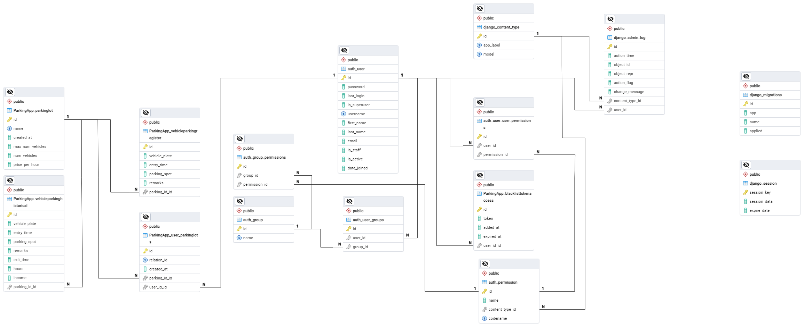

# Parking Management System

## Overview

The Parking Management System is a comprehensive solution for managing parking lots and vehicle entries, utilizing a Django-based REST API and a Flask microservice for email handling. The system supports JWT authentication, role-based access, and provides various indicators and statistics for better parking management.

## Features

- **User Roles**:
  - **Admin**:
    - Manage Socio users (CRUD operations).
    - Manage parking lots (CRUD operations).
    - Send emails to Socio users.
    - View detailed indicators and statistics.
  - **Socio**:
    - Register vehicle entries and exits.
    - View details of associated parking lots and vehicles.
    - Access indicators for associated parking lots.

- **API Endpoints**:
  - **User Management**:
    - `(ADMIN)` `api/register-socio/`: Register a new Socio user.
    - `(ALL)` `api/login/`: Obtain a JWT token.
    - `(ALL)` `api/logout/`: Logout and invalidate the JWT token.
  
  - **Parking Lots**:
    - `(ADMIN` `api/create-parking-lot/`: Create a new parking lot.
    - `(ADMIN)` `api/delete-parking-lot/<int:id>`: Delete a specific parking lot.
    - `(ADMIN)` `api/edit-parking-lot/<int:id>`: Edit a specific parking lot.
    - `(ALL)` `api/parking-lots/`: List all associated parking lots.
    - `(ALL)` `api/parking-lots/<int:id>`: Get details of a specific associated parking lot.

  - **User-Parking Relations**:
    - `(ADMIN)` `api/set-socio-parking/`: Associate a Socio with a parking lot.
    - `(ADMIN)` `api/delete-socio-parking/<int:id>`: Remove a Socio from a parking lot.
  
  - **Vehicle Management**:
    - `(SOCIO)` `api/register-vehicle-entry/`: Register a vehicle entry into a parking lot.
    - `(SOCIO)` `api/register-vehicle-exit/`: Register a vehicle exit from a parking lot.
    - `(ALL)` `api/vehicles-entries/`: List all vehicle entries from associated parking lots.
    - `(ALL)` `api/vehicles-entries/<int:id>`: Get vehicle entries for a specific associated parking lot.

  - **Indicators and Statistics**:
    - `(ADMIN)` `api/top-<int:top>-vehicles-entries/`: Get top N vehicles by entries.
    - `(ADMIN)` `api/top-<int:top>-vehicles-entries/<int:id>`: Get top N vehicles by entries for a specific parking lot.
    - `(ADMIN)` `api/first-time-vehicles/<int:id>`: Get first-time vehicles for a specific parking lot.
    - `(SOCIO)` `api/incomes-parking-lot/<int:id>`: Get summary income data for a specific parking lot in current day, week, month and year.
    - `(SOCIO)` `api/incomes-last-<int:days>-days-parking-lot/<int:id>`: Get income data for the last X days for a specific parking lot.
    - `(ADMIN)` `api/top-socios-vehicles-entries/`: Get top 3 Socios by vehicle entries for the week.
    - `(ADMIN)` `api/top-<int:top>-socios-vehicles-entries/last-<int:days>-days/`: Get top N Socios by vehicle entries for the last X days.
    - `(ADMIN)` `api/top-<int:top>-parking-lots-incomes/`: Get top 3 parking lots by income.

  - **Email Service**:
    - `(ADMIN)` `api/send-mail/`: Send an email to Socio users.

## Installation

### Prerequisites

- Python 3.8 or higher
- PostgreSQL
- Virtual environment (recommended)

### Steps

1. **Clone the Repository**:
    ```bash
    git clone https://github.com/JKGG26/ParkingLot_Manager.git
    ```

2. **Create a Virtual Environment**:
    ```bash
    python -m venv env
    source env\Scripts\activate
    ```

3. **Install Dependencies**:
    ```bash
    pip install -r requirements.txt
    ```

4. **Set Up the Database**:

    Ensure PostgreSQL is installed and running.

    Create a PostgreSQL database and user, and update the database settings in RESTAPI/settings.py.

5. **Set Up the environment variables**:

    Set up environtment variables for database connection and admin credentials:

    - `DB_NAME`="your_db_name"
    - `DB_USER`="your_db_user"
    - `DB_PWD`="your_db_password"
    - `DB_HOST`="your_db_host"
    - `DB_PORT`="your_db_port"
    - `ADMIN_USER`="your_admin_usermail"
    - `ADMIN_PWD`="your_admin_password"

    For example, for local tests with temporal environment variables, you can set them in PowerShell as:

    ```bash
    $env:DB_NAME="my_db_name"
    $env:DB_USER="my_db_user"
    $env:DB_PWD="my_db_password"
    $env:DB_HOST="localhost"
    $env:DB_PORT="5432"
    $env:ADMIN_USER="admin@mail.com"
    $env:ADMIN_PWD="admin"
    ```

6. **Apply Django Migrations**:

    ```bash
    cd RESTAPI
    python manage.py makemigrations
    python manage.py migrate
    ```

7. **Run the Django Server**:
    ```bash
    python manage.py runserver
    ```

8. **Run the Flask Microservice to send Emails**:

    In other terminal out of RESTAPI directory, activate the python 'env' and run the microservices/send_mail.py file with python:

    ```bash
    env\Scripts\activate
    cd microservices
    python send_mail.py
    ```

9. **Use RESTAPI**:

  - `Login` Get `Authorization` token using `/api/login/` and admin credentials
  - `Set` `Authorization` token in headers starting with `Bearer <token>` to access to another endpoints as 'Admin'
  - `Create` Socio users, parking lots, socio-parking relations
  - `Login` Get `Authorization` token using `/api/login/` and Socios credentials
  - `Set` `Authorization` token in headers starting with `Bearer <token>` to access to another endpoints as 'Socio'
  - `Register` vehicles entries and exits
  - `Get` indicators, data and manage data using the endpoints accordint to the role of Authorization token used in header
  - `Logout` users using `/api/logout/`

  ## Database ERD

    Database ERD can be found in `docs` folder

    